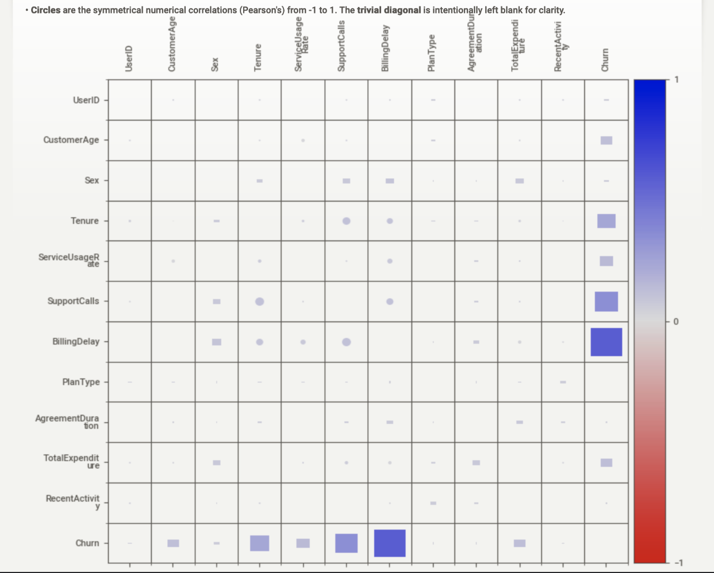
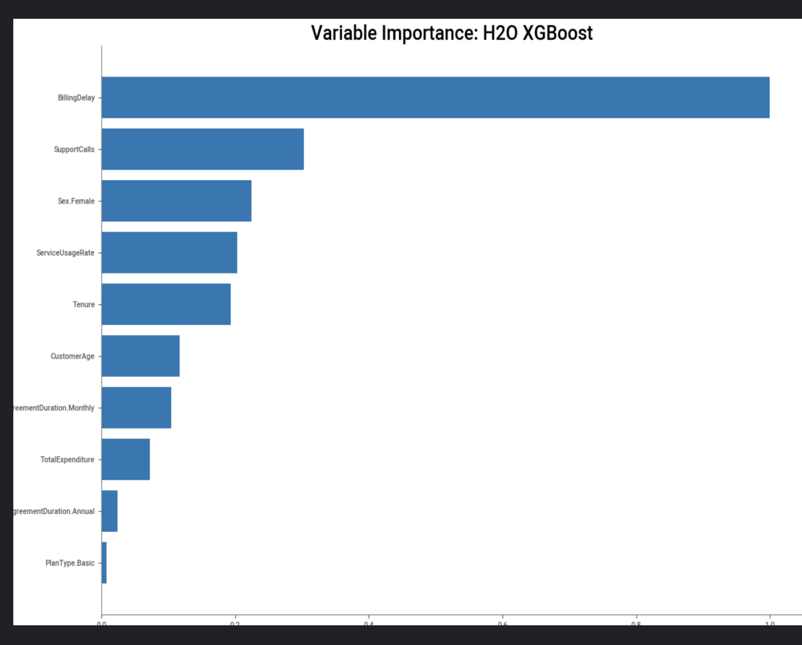
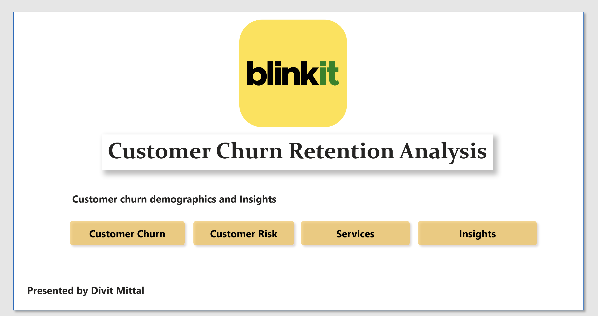

= Blinkit Customer Churn Analysis

:toc: left
:toclevels: 3
:sectnums:

== Overview

This repository contains the analysis and resources related to investigating customer churn for Blinkit, conducted as part of the IIT Guwahati Strategy Storm 2025. The primary objective is to identify key factors contributing to customer attrition and explore potential strategies for churn reduction using data-driven approaches.

The analysis employs a combination of methodologies:

*   **Exploratory Data Analysis (EDA):** Utilizing Python libraries (Pandas, Matplotlib, Seaborn, ydata-profiling, Sweetviz) and Power BI for initial data exploration and visualization.
*   **Automated Machine Learning (AutoML):** Leveraging H2O.ai's AutoML framework to rapidly build and evaluate various predictive models (including XGBoost and Deep Learning) for churn prediction.
*   **Data Visualization:** Using Power BI to create interactive dashboards for visualizing churn patterns and key metrics.

== Project Structure

```
/
├── dashboard/
│   └── Blinkit-Churn-Dashboard.pbix  # Power BI Dashboard file (requires Power BI Desktop)
├── dataset/
│   ├── Churn-Dataset.xlsx            # Original dataset (Excel format)
│   └── Strategy Storm 2025 - Round 2 dataset - SSDataset.csv # Dataset (CSV format)
├── docs/                             # Supporting documents (e.g., presentations, certificates)
│   ├── cert.pdf
│   └── README.pptx
├── src/
│   └── blinkit-churn-analysis.ipynb  # Jupyter Notebook containing Python-based analysis (EDA, AutoML)
├── .gitattributes
├── .gitignore
├── powerbi_data_cleaning.adoc        # AsciiDoc guide on data cleaning in Power BI
├── powerbi_guide.adoc                # AsciiDoc guide on Power BI implementation strategy
└── README.adoc                       # This README file
```

== Dataset

The core dataset (`dataset/Churn-Dataset.xlsx` and `dataset/Strategy Storm 2025 - Round 2 dataset - SSDataset.csv`) contains information on approximately 16,000 Blinkit customers, including demographic details, service usage patterns, and their churn status.

== Analysis Components

=== Python Analysis (Jupyter Notebook)

*   **File:** `src/blinkit-churn-analysis.ipynb`
*   **Description:** This notebook details the primary quantitative analysis. It includes:
    *   Data loading and initial inspection.
    *   Automated EDA using `ydata-profiling` and `Sweetviz` for comprehensive data reports.
    *   Implementation of H2O AutoML to train and compare multiple classification models (XGBoost, Deep Learning, etc.) for predicting churn.
    *   Extraction and analysis of feature importances from the best-performing models.
    *   Parameter extraction and interpretation for selected models (XGBoost, Deep Learning).
*   **Dependencies:** Python 3.x, Jupyter Notebook/Lab, Pandas, NumPy, Matplotlib, Seaborn, ydata-profiling, Sweetviz, H2O.ai.

.Example Visualizations from Python Analysis
[%collapsible]
====



====

=== Power BI Analysis

*   **Files:**
    *   `dashboard/Blinkit-Churn-Dashboard.pbix`: The interactive Power BI report file.
    *   `powerbi_guide.adoc`: Technical documentation outlining the strategy for data ingestion, modeling, and visualization within Power BI.
    *   `powerbi_data_cleaning.adoc`: Technical documentation detailing data cleaning and transformation techniques using Power Query.
*   **Description:** Power BI is used for visual exploration and dashboarding. It provides an interactive way to slice and dice the data, visualizing churn rates across different customer segments and identifying high-level trends. The `.adoc` files provide methodological context for the Power BI implementation.

.Power BI Dashboard Snippet

